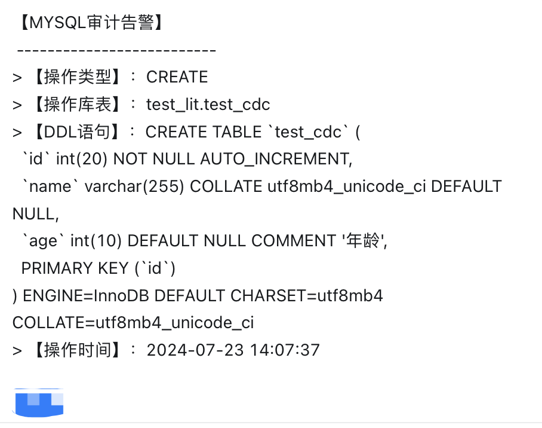
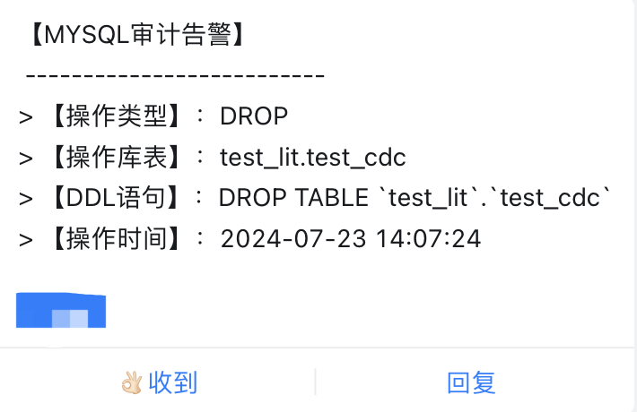
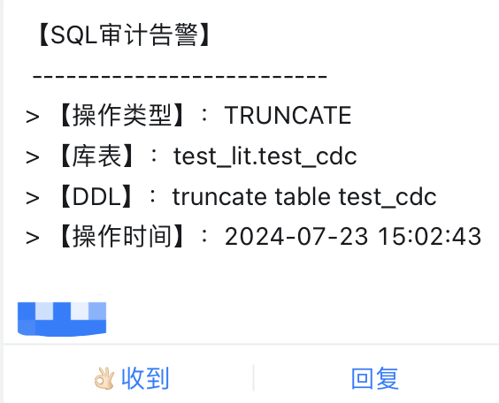
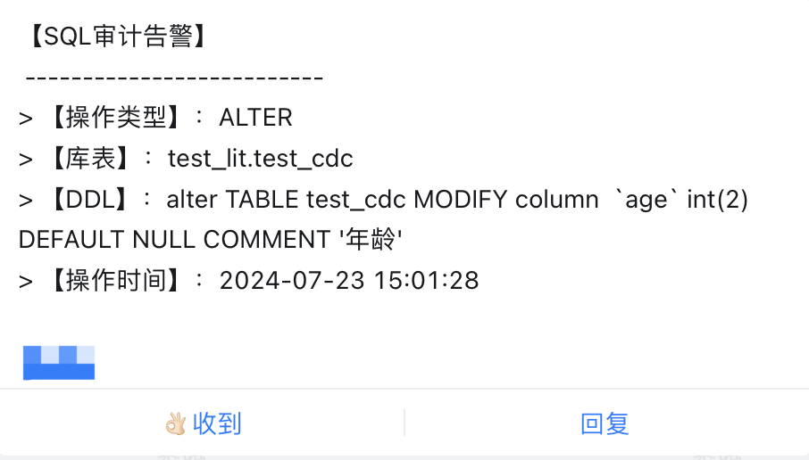

###                                                   audit-sql-application

#### 一、项目能力：

基于FlinkCDC-3.1.1和Flink-1.18技术栈，采用Flink on yarn部署模式，实现增量监听Mysql数据库，对Mysql中的DDL语句做审计告警，将告警消息发送至钉钉告警群。

#### 二、主要技术架构：

| 技术栈           | 版本     |
|---------------|--------|
| java          | 1.8    |
| FlinkCDC      | 3.1.1  |
| Flink         | 1.18.0 |
| Hadoop (yarn) | 2.8.3  |

#### 三、部署流程：

1. **安装`Java`环境和`Hadoop`环境，步骤略；**

2. **安装`Flink`环境：**

```shell
-> wget https://archive.apache.org/dist/flink/flink-1.18.0/flink-1.18.0-bin-scala_2.12.tgz
-> tar -zxvf flink-1.18.0-bin-scala_2.12.tgz
-> mkdir ./flink-1.18.0/job
```

3. **下载`Flink`与`Hadoop`整合相关依赖`jar`包：**

```shell
-> cd flink-1.18.0/lib
-> wget https://repo.maven.apache.org/maven2/org/apache/flink/flink-shaded-hadoop-2-uber/2.8.3-10.0/flink-shaded-hadoop-2-uber-2.8.3-10.0.jar
```

4. **配置`flink-conf.yaml`文件，主要配置如下参数**：

| 配置项                   | value                                            | 说明                   |
|-----------------------|--------------------------------------------------|----------------------|
| state.backend         | filesystem                                       | 状态后端存储模式             |
| state.checkpoints.dir | hdfs://${HOST_NAME}:8020/flink/flink-checkpoints | checkpoint地址，基于hdfs  |
| state.savepoints.dir  | hdfs://${HOST_NAME}:8020/flink/flink-savepoints  | savepoint地址，同样基于hdfs |
| env.java.opts         | "-Dfile.encoding=UTF-8"                          | 全局编码（**重要配置，必须要加引号）  |

5. **建立钉钉群，并创建告警机器人**。

   创建过程略；（注意：当前版本只能处理为加签机器人，关键字设置为`告警`，`审计`）；

6. **打包并上传：**

```shell
-> git clone 
-> mvn clean package -Dmaven.test.skip=ture
```

​      将`jar`包上传到`/flink-1.18.0/job`目录下。

7. **创建配置文件**:

​       你可以手动新增配置文件，也可以将项目中的`config.json`文件直接上传到`/flink-1.18.0/job`目录下，如下展示新增过程：

```shell
-> cd /flink-1.18.0/job
-> vim config.json
```

```json
{
  "auditName": "sql-audit",
  任务名称
  "job": {
    "serverId": "",
    "startMode": "latest",
    "timestamp": ""
  },
  "source": {
    "sourceType": "mysql",
    "hostname": "127.0.0.1",
    "port": 3306,
    "username": "root",
    "password": "root",
    "databaseList": [],
    "tableList": [],
    "blackDatabaseList": []
  },
  "alarm": {
    "alarmType": "WEBHOOK",
    "webhook": "https://oapi.dingtalk.com/robot/send?access_token=${YOUR_TOKEN}",
    "msgtype": "text",
    "at": {
      "isAtAll": false,
      "atMobiles": [
        "13400000000"
      ]
    }
  }
}
```

配置文件内容描述如下：

| 参数名               | 是否必填 | 默认值       | 说明                                                          |
|-------------------|------|-----------|-------------------------------------------------------------|
| auditName         | 是    | sql-audit | 任务名称                                                        |
| serverId          | 否    | -         | mysql slave server_id                                       |
| startMode         | 是    | latest    | Flink启动模式（支持 `initial`,`earliest`,`latest`及`timestamp`四种模式） |
| timestamp         | 否    | Null      | 如果启动模式设置为`timestamp`，则该值必须设置                                |
| sourceType        | 是    | mysql     | 数据源类型，当前只支持`mysql`                                          |
| hostname          | 是    | -         | `mysql`连接ip                                                 |
| port              | 是    | -         | `mysql`连接端口                                                 |
| username          | 是    | -         | `mysql`连接用户名                                                |
| password          | 是    | -         | `mysql`连接密码                                                 |
| databaseList      | 否    | -         | `Flinkcdc `监听的数据库列表                                         |
| tableList         | 否    | -         | `Flinkcdc `监听的数据表列表                                         |
| blackDatabaseList | 否    | -         | 需要过滤掉的黑名单数据库列表                                              |
| alarmType         | 是    | WEBHOOK   | 告警类型，默认为钉钉，当前也只支持钉钉                                         |
| webhook           | 是    | -         | `webhook`地址                                                 |
| msgtype           | 是    | text      | 消息类型，钉钉消息类型支持`markdown`和`text`                              |
| isAtAll           | 是    | false     | 是否@所有人                                                      |
| atMobiles         | 是    |           | @人手机号                                                       |

8. **创建启动脚本**：

```shell
-> vim start.sh
-> sh start.sh
```

```bash
#!/bin/bash

export JAVA_HOME=${YOUR_JAVA_PATH}/jdk1.8.0_181
export PATH=$JAVA_HOME/bin:$PATH
export HADOOP_CLASSPATH=`hadoop classpath`
export HADOOP_USER_NAME=hdfs

flink_home=$PWD/../../bin
jar_path=$PWD/sql-audit.jar
config_path=$PWD/config.json
job_name=sql-audit-app

$flink_home/flink run -c com.someway.MySQLAuditExec -m yarn-cluster -ynm $job_name  -p 1 -yjm 1024 -ytm 1024 -yD env.java.opts="-Dfile.encoding=UTF-8" ${jar_path} ${config_path}
```

9. **告警测试**：

通过在数据库创建表，删除表，truncate表和alert表，能够捕获如下审计告警：

- **Create 告警样例：**
- 
- **DROP 告警样例**：
- 
- **Truncate 告警样例：**
- 
- **Alter 告警样例：**
- 

#### 四、最后

当前项目属于V0.1版本，里面支持的数据源不是很全面，告警渠道也有限。如果有需要的小伙伴，可以自行下载代码，然后做二次开开发。FlinkCDC 3.0版本提供了很多新能力，为数据同步提供了更多的保障机制和可能性，后续会继续探索其他新功能和新使用场景。有需要交流的小伙伴，欢迎关注我的公众号，一起交流学习。

***如果需要源码的小伙伴，关注公众号后回复"SQL审计"自动获取代码地址***。


